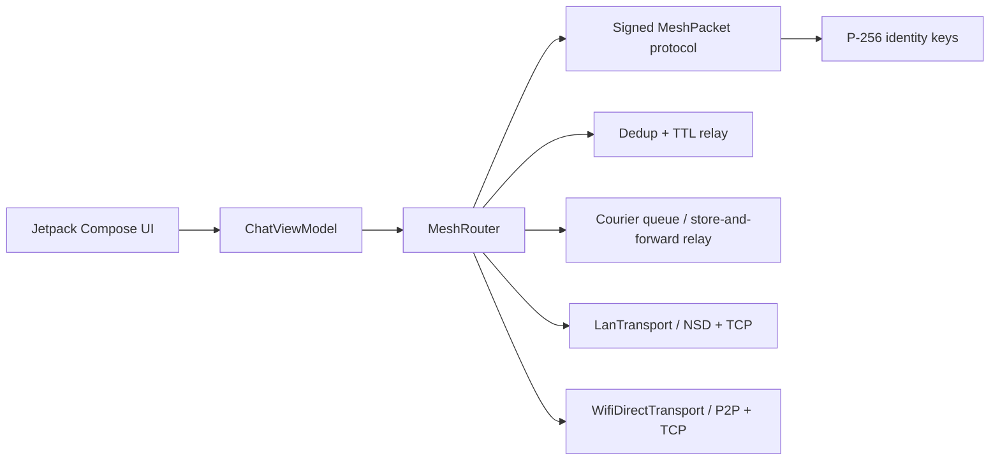

# AirChat for Android

[](https://github.com/thanhaq/airchat-android/actions/workflows/android-ci.yml)
[](https://github.com/thanhaq/airchat-android/actions/workflows/release.yml)
[](app/build.gradle.kts)
[](LICENSE)


AirChat is an offline-first Android messenger that can move messages across nearby phones without internet access. The first transport is local Wi-Fi LAN discovery through Android NSD. The second transport is Wi-Fi Direct, including peer discovery, group formation hooks, and socket framing for group-owner relay.

The project is intentionally structured like a serious open-source repo: small protocol layer, transport interfaces, signed packets, encrypted direct messages, deduplication, relay TTL, Compose UI, tests, security notes, and CI.


AirChat is not protocol-compatible with BitChat. It is an Android Wi-Fi take on the same resilient, accountless messaging idea; see [BitChat parity and differentiation](docs/BITCHAT_PARITY.md) for the honest feature matrix and roadmap.

## Current launch status

- Public source is on `main` with GitHub Actions running unit tests, debug APK build, and Android lint.
- `v0.1.0` has a draft GitHub Release package generated by CI as a debug test APK, plus `RELEASE_MANIFEST.json`, `SHA256SUMS.txt`, and release notes.
- Keep the release draft until the physical-device field-test report is complete.
- Promote a signed public APK after release keystore secrets are configured in GitHub Actions.

## What works now

- Local Wi-Fi chat over a router, hotspot, or offline access point.
- F-Droid-oriented `fdroid` distribution flavor with no proprietary SDKs, accounts, analytics, push service, or hosted backend.
- Wi-Fi Direct peer discovery and connection flow.
- Signed mesh packets using per-install P-256 identity keys.
- Encrypted direct messages between peers with known public keys.
- Passphrase-locked private rooms for encrypted group text and file transfer, with room verification codes and strength hints.
- Encrypted local message and outbox persistence through Android Keystore AES-GCM.
- Foreground background mesh mode so discovery and relay can stay alive after leaving the app, with privacy-preserving alerts for new messages and files.
- Battery-aware background mesh policy with visible normal/conserve/critical modes, relay TTL clamping, and courier storage pause at critical battery.
- Panic wipe for local history, outbox, peer cache, and identity on disk.
- Safety-number fingerprints, trust confirmation, and key-change protection for peers.
- Persistent peer blocklist with UI actions and `/block` / `/unblock` commands.
- QR and shareable safety-number cards plus private-room invite cards for out-of-band verification without exposing passphrases.
- PacketGuard checks for payload size, TTL, route length, timestamp skew, and per-origin rate limits.
- Public-channel and encrypted direct file transfer with Android picker, chunking, persistent encrypted inbox, inline previews for common file types, save/share actions, and SHA-256 verification.
- Message deduplication, TTL-limited relay, signed delivery receipts, and bounded encrypted courier relay with user-visible retention controls, per-origin quota controls, and user-visible relay receipts.
- Public-room history sync that lets peers exchange recent signed public chat packets after reconnect without replaying private rooms, DMs, or files.
- IRC-style slash commands for room switching, direct messages, action messages, peer lists, and local help.
- Multi-room switcher with unread counts, file counts, private-room markers, persistent pinned favorites, and manual room reorder controls.
- In-app diagnostics report with identity-key backing, transport states, peer/room counts, unread-room counts, a privacy-preserving recent event log, structured JSON export, Logcat mirroring, and share action for field testing.
- Compose UI with peer list, room strip, channel composer, DM mode, status chips, and verified/unverified message state.
- Unit tests for packet serialization, direct-message crypto, private-room crypto, room summaries, conversation filtering, packet guard, file chunking, ACK receipts, courier receipt state, courier relay, and dedup behavior.

## Why Wi-Fi instead of Bluetooth

Bluetooth mesh is great for low power proximity, but Wi-Fi gives higher throughput and a more natural path for group chat, media, and local-first collaboration. AirChat starts with pragmatic Android transports:

- LAN mode: easiest path when devices share a hotspot or local router with no internet.
- Wi-Fi Direct mode: phone-to-phone links without an access point.
- Future Wi-Fi Aware mode: lower-friction discovery on supported devices.

## Architecture



## Project layout

```text
app/src/main/java/dev/offlinemesh/airchat
+-- core              # app container and UI state
+-- crypto            # identity, signing, ECDH/AES-GCM helper
+-- model             # peers, messages, delivery state
+-- protocol          # packet schema, codec, deduper
+-- store             # encrypted persistence and outbox storage
+-- transport         # mesh transport contracts and router
+-- transport/lan     # NSD advertisement/discovery and TCP packets
+-- transport/wifidirect
+-- ui                # Compose screens and theme
```

## Run

Open `offline-mesh-chat-android` in Android Studio, let Gradle sync, then run the `app` target on two physical Android devices.

For local Wi-Fi mode:

1. Put both devices on the same router or phone hotspot.
2. Start AirChat on both.
3. Wait for `LAN: Ready`.
4. Send a message in the `lobby` channel.

For Wi-Fi Direct mode:

1. Grant nearby Wi-Fi permission.
2. Wait for peers to appear.
3. Tap `Link` on a peer.
4. Send messages after connection state becomes connected.

For direct messages:

1. Wait until a peer appears with a public key.
2. Tap `DM`.
3. Send a message.
4. Tap `Room` to return to public-channel mode.

For rooms:

1. Type `/join room` or edit the channel field to create or switch rooms.
2. Tap the star beside a room chip to pin or unpin it.
3. Use the arrow controls beside room chips to move active rooms earlier or later in the strip.
4. Pinned rooms and room order remain visible across app restarts.

For courier relay:

1. Tap the `Courier` status chip.
2. Toggle store-and-forward relay on or off.
3. Pick a 5, 15, or 60 minute retention window.
4. Pick a per-origin quota so one peer cannot monopolize local courier storage.
5. Clear the encrypted courier queue manually before sensitive handoff tests.

Composer commands:

- `/join room` or `/j room` switches to a public channel.
- `/lock passphrase` encrypts the current room with a shared passphrase held only in memory.
- `/code` shows the current private room's verification code and passphrase-strength label.
- `/rotate passphrase` replaces the current room key with a new passphrase.
- `/unlock` clears the current room key from this device.
- `/room` or `/lobby` leaves the current DM and returns to room mode.
- `/msg peer text` or `/dm peer text` sends an encrypted direct message to a matching peer name or peer id prefix.
- `/block peer` drops future packets from a peer and prevents direct sends to that peer.
- `/block`, `/blocks`, or `/blocked` lists blocked peer ids.
- `/unblock peer` removes a peer from the local blocklist.
- `/me action` sends an action-style message to the active conversation.
- `/who` lists visible peers locally.
- `/help` shows the command list locally.

For peer verification:

1. Tap `Trust` on a peer with a public key.
2. Compare the safety number or QR safety card out of band.
3. Use `Share safety card` when the other device needs a text payload instead of the QR card.
4. Confirm the dialog only after the code matches.
5. If the same peer id later advertises a different public key, AirChat marks it `Key changed` and blocks direct sends until you explicitly trust the new key.
6. Use the top-bar trust-backup icon to share a signed JSON backup of trusted peer public keys. The backup includes the exporting device's public key and signature, but no private keys, messages, room passphrases, or file contents.
7. Use the import trust-backup icon on another device to select the backup file. AirChat verifies the exporter signature first, shows a review dialog, imports new trusted peers, and skips self records or key conflicts instead of overwriting existing trust.

To block a peer, tap the block icon in its peer row or type `/block peer`. Blocked peers stay visible when discovered so they can be unblocked, but AirChat drops their packets before display, ACK, relay, or courier storage.

For private-room invites, tap the `Private` room chip to show a QR invite card. The QR contains the room name and room-code fingerprint, not the passphrase. Use `Share` to send the same invite payload as text.

For files:

1. Stay in a public channel, or select a peer with `DM`.
2. Tap the attach icon in the message composer.
3. Pick a file up to 10 MB.
4. Public files use room packets; private-room files use encrypted room packets; DM files are wrapped inside encrypted direct packets.
5. Peers reassemble the transfer when every chunk arrives and the SHA-256 hash matches.
6. Tap the save icon beside a received file to write it to device storage, or the share icon to send it through Android's share sheet.
7. Text files show a short inline snippet, images show a thumbnail when Android can decode them, and common documents show a clear type label.

For background mesh mode:

1. Grant notification permission on Android 13+.
2. Tap the notification icon in the top bar.
3. AirChat starts a foreground service and keeps LAN/Wi-Fi Direct discovery and relay active.
4. Check the `Power` chip or diagnostics for normal, conserve, or critical battery mode.
5. In conserve mode AirChat clamps relay TTL and spaces courier flushes; in critical mode it pauses new courier storage while keeping local send/receive paths available.
6. When the app is not on screen, AirChat can post a generic new-message or new-file alert without message bodies or file names.
7. Tap the same icon again or use `Stop` from the notification to leave background mode.

For diagnostics:

1. Tap the info icon in the top bar.
2. Check identity-key backing, Android version, private-room code/strength, visible peer/room count, unread-room count, transport states, and recent diagnostic events.
3. Use `Share` when attaching a field-test report or GitHub issue.
4. Compare two device reports or structured JSON exports with `scripts/compare-diagnostics.ps1` when debugging asymmetric discovery or delivery.
5. Capture matching Logcat snippets with `adb logcat -s AirChat` when diagnosing discovery, socket, relay, or import failures on physical devices.

## Build from terminal

Requirements: JDK 17 and Android SDK platform 35.

```powershell
.\gradlew.bat :app:testFdroidDebugUnitTest :app:assembleFdroidDebug :app:lintFdroidDebug
```

Or run the preflight helper, which also prints the debug APK SHA-256:

```powershell
.\scripts\preflight.ps1
```

To package a labeled debug test build and SHA file for GitHub Releases:

```powershell
.\scripts\package-debug-release.ps1 v0.1.0
```

The package scripts write `release/RELEASE_NOTES.md`, `release/SHA256SUMS.txt`, and `release/RELEASE_MANIFEST.json` for release verification.

To verify a generated release folder before publishing:

```powershell
.\scripts\verify-release.ps1 release\RELEASE_MANIFEST.json
```

To package a signed public APK after configuring release signing environment variables:

```powershell
.\scripts\package-signed-release.ps1 v0.1.0
```

To publish after creating an empty GitHub repository:

```powershell
.\scripts\publish-github.ps1 https://github.com/<owner>/airchat-android.git -Tag v0.1.0
```

On macOS or Linux:

```bash
bash ./gradlew :app:testFdroidDebugUnitTest :app:assembleFdroidDebug :app:lintFdroidDebug
```

The debug APK is written to `app/build/outputs/apk/fdroid/debug/app-fdroid-debug.apk`.

## Security model

AirChat authenticates packets with ECDSA signatures. On Android 12+ new installs prefer non-exportable Android Keystore P-256 identity keys for both signing and ECDH; older or incompatible devices fall back to app-private software keys that are excluded from Android backup. Direct messages are encrypted with ephemeral ECDH over P-256 and AES-GCM. Private rooms derive an in-memory AES-GCM key from the room passphrase and channel name, then encrypt text, file manifests, and file chunks per packet with fresh nonces. Each room key gets a short verification code so participants can compare that they entered the same passphrase without saying the passphrase itself; private-room invite cards carry the room name and code only, never the passphrase. Local message history, outbox entries, trust records, courier relay packets, and received-file inbox entries are encrypted with Android Keystore AES-GCM keys. Public channels are intentionally visible to local peers, similar to IRC rooms on a local mesh.

Next security milestones:

- Add a Noise-style session handshake for direct messages.
- Add stronger transport binding.
- Add camera scan-to-verify for QR safety cards.

## Roadmap

- Camera scan-to-verify for QR safety cards.
- Courier per-peer quota controls, richer receipt details, and expiry tuning.
- Wi-Fi Aware transport for supported Android devices.
- F-Droid screenshots and reproducible build notes.

## Docs

- [Protocol](docs/PROTOCOL.md)
- [Threat model](docs/THREAT_MODEL.md)
- [Android Wi-Fi notes](docs/ANDROID_WIFI_NOTES.md)
- [BitChat parity and differentiation](docs/BITCHAT_PARITY.md)
- [Test plan](docs/TEST_PLAN.md)
- [Diagnostics workflow](docs/DIAGNOSTICS.md)
- [Demo script](docs/DEMO_SCRIPT.md)
- [Release guide](docs/RELEASE.md)
- [Release verification](docs/VERIFY_RELEASE.md)
- [GitHub launch checklist](docs/GITHUB_LAUNCH.md)
- [F-Droid readiness](docs/FDROID.md)
- [Launch status](docs/LAUNCH_STATUS.md)
- [Field test report template](docs/FIELD_TEST_REPORT.md)
- [Roadmap](docs/ROADMAP.md)
- [Privacy policy](PRIVACY_POLICY.md)

## License

MIT
