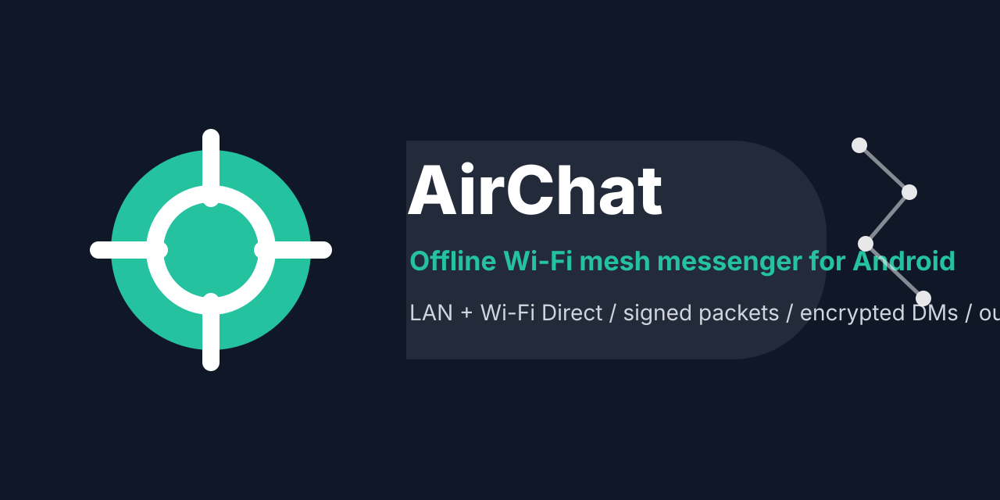
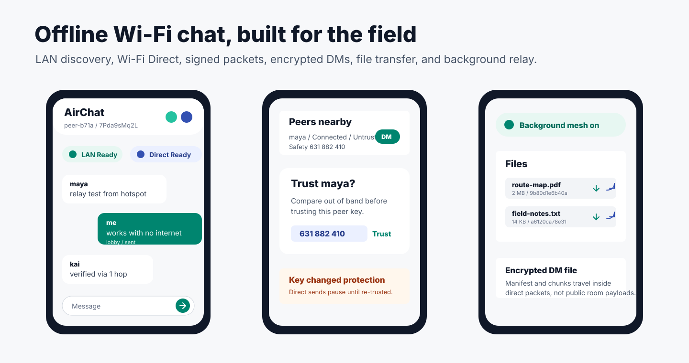
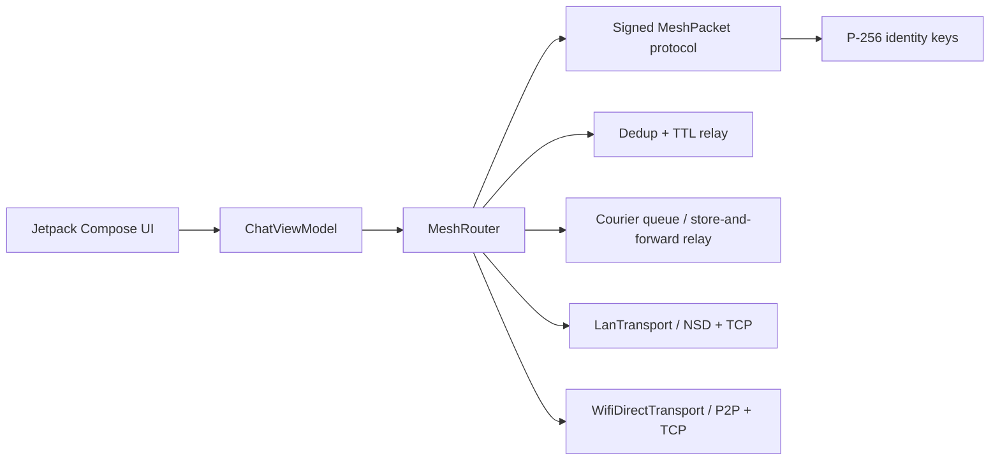

# AirChat for Android

[](.github/workflows/android-ci.yml)
[](app/build.gradle.kts)
[](LICENSE)



AirChat is an offline-first Android messenger that can move messages across nearby phones without internet access. The first transport is local Wi-Fi LAN discovery through Android NSD. The second transport is Wi-Fi Direct, including peer discovery, group formation hooks, and socket framing for group-owner relay.

The project is intentionally structured like a serious open-source repo: small protocol layer, transport interfaces, signed packets, encrypted direct messages, deduplication, relay TTL, Compose UI, tests, security notes, and CI.



## What works now

- Local Wi-Fi chat over a router, hotspot, or offline access point.
- Wi-Fi Direct peer discovery and connection flow.
- Signed mesh packets using per-install P-256 identity keys.
- Encrypted direct messages between peers with known public keys.
- Encrypted local message and outbox persistence through Android Keystore AES-GCM.
- Foreground background mesh mode so discovery and relay can stay alive after leaving the app.
- Panic wipe for local history, outbox, peer cache, and identity on disk.
- Safety-number fingerprints, trust confirmation, and key-change protection for peers.
- PacketGuard checks for payload size, TTL, route length, timestamp skew, and per-origin rate limits.
- Public-channel and encrypted direct file transfer with Android picker, chunking, persistent encrypted inbox, save/share actions, and SHA-256 verification.
- Message deduplication, TTL-limited relay, signed delivery receipts, and bounded encrypted courier relay between transports.
- IRC-style slash commands for room switching, direct messages, action messages, peer lists, and local help.
- In-app diagnostics report with identity-key backing, transport states, peer counts, and share action for field testing.
- Compose UI with peer list, channel composer, DM mode, status chips, and verified/unverified message state.
- Unit tests for packet serialization, direct-message crypto, conversation filtering, packet guard, file chunking, ACK receipts, courier relay, and dedup behavior.

## Why Wi-Fi instead of Bluetooth

Bluetooth mesh is great for low power proximity, but Wi-Fi gives higher throughput and a more natural path for group chat, media, and local-first collaboration. AirChat starts with pragmatic Android transports:

- LAN mode: easiest path when devices share a hotspot or local router with no internet.
- Wi-Fi Direct mode: phone-to-phone links without an access point.
- Future Wi-Fi Aware mode: lower-friction discovery on supported devices.

## Architecture



## Project layout

```text
app/src/main/java/dev/offlinemesh/airchat
+-- core              # app container and UI state
+-- crypto            # identity, signing, ECDH/AES-GCM helper
+-- model             # peers, messages, delivery state
+-- protocol          # packet schema, codec, deduper
+-- store             # encrypted persistence and outbox storage
+-- transport         # mesh transport contracts and router
+-- transport/lan     # NSD advertisement/discovery and TCP packets
+-- transport/wifidirect
+-- ui                # Compose screens and theme
```

## Run

Open `offline-mesh-chat-android` in Android Studio, let Gradle sync, then run the `app` target on two physical Android devices.

For local Wi-Fi mode:

1. Put both devices on the same router or phone hotspot.
2. Start AirChat on both.
3. Wait for `LAN: Ready`.
4. Send a message in the `lobby` channel.

For Wi-Fi Direct mode:

1. Grant nearby Wi-Fi permission.
2. Wait for peers to appear.
3. Tap `Link` on a peer.
4. Send messages after connection state becomes connected.

For direct messages:

1. Wait until a peer appears with a public key.
2. Tap `DM`.
3. Send a message.
4. Tap `Room` to return to public-channel mode.

Composer commands:

- `/join room` or `/j room` switches to a public channel.
- `/room` or `/lobby` leaves the current DM and returns to room mode.
- `/msg peer text` or `/dm peer text` sends an encrypted direct message to a matching peer name or peer id prefix.
- `/me action` sends an action-style message to the active conversation.
- `/who` lists visible peers locally.
- `/help` shows the command list locally.

For peer verification:

1. Compare the safety number out of band.
2. Tap `Trust` on that peer.
3. Confirm the dialog only after the code matches.
4. If the same peer id later advertises a different public key, AirChat marks it `Key changed` and blocks direct sends until you explicitly trust the new key.

For files:

1. Stay in a public channel, or select a peer with `DM`.
2. Tap the attach icon in the message composer.
3. Pick a file up to 10 MB.
4. Public files use room packets; DM files are wrapped inside encrypted direct packets.
5. Peers reassemble the transfer when every chunk arrives and the SHA-256 hash matches.
6. Tap the save icon beside a received file to write it to device storage, or the share icon to send it through Android's share sheet.

For background mesh mode:

1. Grant notification permission on Android 13+.
2. Tap the notification icon in the top bar.
3. AirChat starts a foreground service and keeps LAN/Wi-Fi Direct discovery and relay active.
4. Tap the same icon again or use `Stop` from the notification to leave background mode.

For diagnostics:

1. Tap the info icon in the top bar.
2. Check identity-key backing, Android version, visible peer count, and transport states.
3. Use `Share` when attaching a field-test report or GitHub issue.

## Build from terminal

Requirements: JDK 17 and Android SDK platform 35.

```powershell
.\gradlew.bat :app:testDebugUnitTest :app:assembleDebug :app:lintDebug
```

Or run the preflight helper, which also prints the debug APK SHA-256:

```powershell
.\scripts\preflight.ps1
```

To package a labeled debug test build and SHA file for GitHub Releases:

```powershell
.\scripts\package-debug-release.ps1 v0.1.0
```

On macOS or Linux:

```bash
bash ./gradlew :app:testDebugUnitTest :app:assembleDebug :app:lintDebug
```

The debug APK is written to `app/build/outputs/apk/debug/app-debug.apk`.

## Security model

AirChat authenticates packets with ECDSA signatures. On Android 12+ new installs prefer non-exportable Android Keystore P-256 identity keys for both signing and ECDH; older or incompatible devices fall back to app-private software keys that are excluded from Android backup. Direct messages are encrypted with ephemeral ECDH over P-256 and AES-GCM. Local message history, outbox entries, trust records, courier relay packets, and received-file inbox entries are encrypted with Android Keystore AES-GCM keys. The public channel is intentionally visible to local peers, similar to an IRC room on a local mesh.

Next security milestones:

- Add a Noise-style session handshake for direct messages.
- Add stronger transport binding and QR safety-number verification.

## Roadmap

- QR safety-number verification.
- Multi-channel switching UI with pinned favorite rooms.
- Courier per-peer quotas, relay receipts, and user-visible retention controls.
- Wi-Fi Aware transport for supported Android devices.
- Inline preview for common received file types.
- Battery-aware tuning for background foreground service.
- F-Droid ready flavor without proprietary dependencies.

## Docs

- [Protocol](docs/PROTOCOL.md)
- [Threat model](docs/THREAT_MODEL.md)
- [Android Wi-Fi notes](docs/ANDROID_WIFI_NOTES.md)
- [Test plan](docs/TEST_PLAN.md)
- [Demo script](docs/DEMO_SCRIPT.md)
- [Release guide](docs/RELEASE.md)
- [Release verification](docs/VERIFY_RELEASE.md)
- [GitHub launch checklist](docs/GITHUB_LAUNCH.md)
- [Roadmap](docs/ROADMAP.md)
- [Privacy policy](PRIVACY_POLICY.md)

## License

MIT
